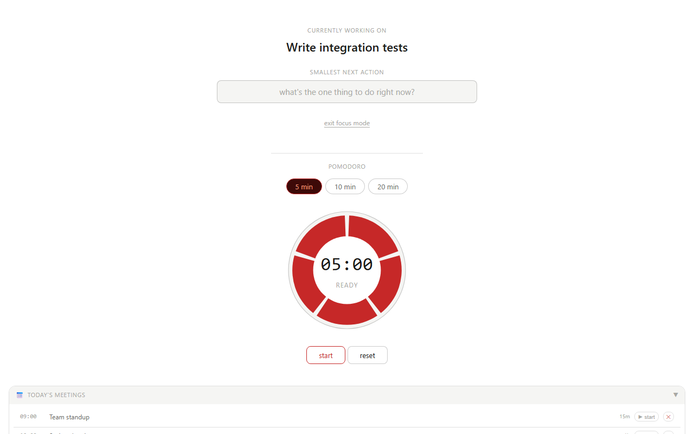

# Work Log

ADHD-friendly work tracker — single HTML file, runs locally in your browser.

## Screenshots




## How to use

> **Important:** The tracker needs to run via a local server (not opened directly as a file) so your data saves correctly between sessions.

### Windows
1. Download `work-log.html`, `launch.bat`, and `start-server.ps1` into the same folder
2. Double-click `launch.bat`
3. The tracker opens automatically in your browser

### Linux / Mac
1. Download `work-log.html` and `launch.sh` into the same folder
2. Open a terminal in that folder and run:
   ```
   bash launch.sh
   ```
3. The tracker opens automatically in your browser

Your data is stored locally in your browser — nothing is sent anywhere.

> **Data lives per-origin, so keep the port stable.** Your entries are stored in your browser's `localStorage`, which is scoped to the exact `origin:port` you loaded the page from. Both launchers use a fixed port (`8080`) for this reason — if you ever load the tracker from a different port, your previous data won't show up (it's not gone, it's just stranded on the old port). Reload `http://localhost:8080/work-log.html` to get it back.

## Features

### Time tracking
- **Live timer** — start a timer on any task, pause and resume, add a handoff note when stopping
- **Billable tracking** — mark epics and individual entries as billable; totals shown per task and per day
- **Quick pick** — recent tasks shown as chips for fast re-logging
- **Long-running timer warning** — dismissible alert once a running timer passes 4 hours, with a one-click stop; also asks whether to stop if you return to the tab after it's sat hidden 30+ minutes mid-session

### Tasks
- **Kanban board** — drag tasks between To Do / In Progress / Done columns with epic colour coding
- **WIP warning** — amber highlight and dismissable banner when more than one task is in progress
- **Task subtasks** — split any task into child steps; completing all steps completes the parent
- **Deadlines** — date picker with overdue (red) and due-today (amber) highlighting
- **Auto-carry** — unfinished tasks roll over to the next day automatically
- **Jira import** — paste a Jira CSV export to bulk-add tickets as tasks
- **Weekly plan review** — a dismissible checklist appears once a new week begins for any task planned ahead ("upcoming") and dated within it, so you can confirm it's still accurate before the week starts

### Today's Flow
- **Flow view** — chronological feed merging time entries, log notes, and task updates for the day
- **Log view** — editable time log with duration, epic, billable flag, and ad-hoc entry row
- **Proof links & notes** — attach a link (Confluence page, Zephyr key, filename, or a URL) and a one-line note to any entry; shown as 🔗/📝 indicators and carried into exports
- **Blocks view** — visual 08:00–18:00 timeblock grid auto-filled from logged entries; drag to rearrange
- **Month view** — heatmap of hours per day with intensity colouring; monthly summary and task inventory
- **Rolling Summary** — AI-ready summary of recent activity across configurable days

### Focus mode
- **Focus screen** — one-click distraction-free view showing only the active task and next steps
- **Parked thoughts** — capture stray thoughts mid-focus without leaving the screen
- **Pomodoro timer** — 5 / 10 / 20 min ring timer with session log; visible in focus mode

### Planning
- **Today's meetings** — fetched live from Outlook calendar (Windows); shows time, duration, Teams join link
- **Day streak** — consecutive days with logged work

### Export & review
- **End the day** — one-click summary with test areas and tomorrow's notes, exported as .txt
- **Auto-backup** — JSON backup saved automatically on end-of-day to a local `JSON backups/` folder
- **Reflection** — end-of-day focus-quality and energy ratings with an optional note
- **Weekly report** — copy-to-clipboard draft summarising the calendar week's tracked time grouped by Jira ticket, for writing status updates without reconstructing "what did I touch" by hand
- **Gap report** — flags this week's finished, billable entries that are missing a note or proof link, with a one-click jump to fix each one

### Bullet Journal (BuJo) features
- **Rapid logging** — `✏️` button opens a floating capture panel; `Enter` starts the timer immediately
- **Signifiers** — clickable symbol on each entry cycles through meeting / flagged / migrated / cancelled / overtime; cancelled entries are excluded from totals
- **Daily Log** — tab view merging time entries, log notes, and task updates in a single chronological feed
- **Monthly Log** — heatmap of hours per day with intensity colouring; monthly summary and task inventory
- **Migration** — end-of-month close-out flow: carry forward, reschedule, or drop each open task
- **Trackers** — custom 28-day progress grids with a daily target and streak counter
- **Sprints** — intention-first focus sessions: declare an outcome, run a Pomodoro, then record yes / partly / no

### Info widgets
- **Weather** — current conditions, rain forecast, sunrise/sunset (Helsinki)
- **Moon phase** — current phase, illumination %, and zodiac sign
- **Finnish nameday** — fetched live from nimipaivat.fi

## Project documentation

| Document | Purpose |
|----------|---------|
| [ARCHITECTURE.md](ARCHITECTURE.md) | Module map, data flow, and design decisions |
| [DATA.md](DATA.md) | localStorage schema dictionary |
| [CONTRIBUTING.md](CONTRIBUTING.md) | Dev setup, branching strategy, and quality standard |
| [ROADMAP.md](ROADMAP.md) | Planned and in-progress features |
| [CHANGELOG.md](CHANGELOG.md) | Full release history |
| [QA.md](QA.md) | QA checklist and stakeholder sign-offs per release |

## Testing

A smoke test suite is included. Requires Node.js ≥ 22.22.1 (matches `engines` in `package.json` — the actual floor imposed by `lint-staged`'s own minimum).

```
node smoke-tests.cjs
```

Or double-click `run-tests.bat` on Windows.

If your environment has a pre-provisioned Chromium binary at a revision Playwright's
own installer can't reach (e.g. an offline sandbox), point the smoke tests at it with
`PLAYWRIGHT_CHROMIUM_EXECUTABLE_PATH=/path/to/chromium node smoke-tests.cjs` instead of
running `npx playwright install`.

To schedule tests to run automatically each morning, run `schedule-tests.bat` once as Administrator.

To set up automated weekly releases every Friday, run `setup-scheduler.ps1` once as Administrator.
