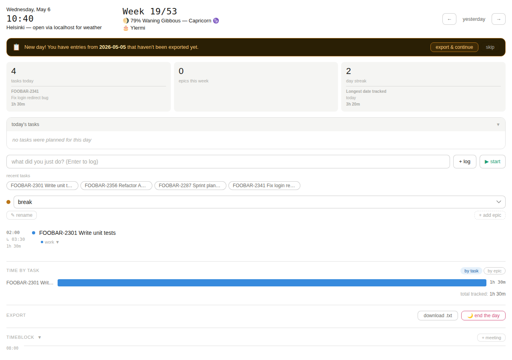
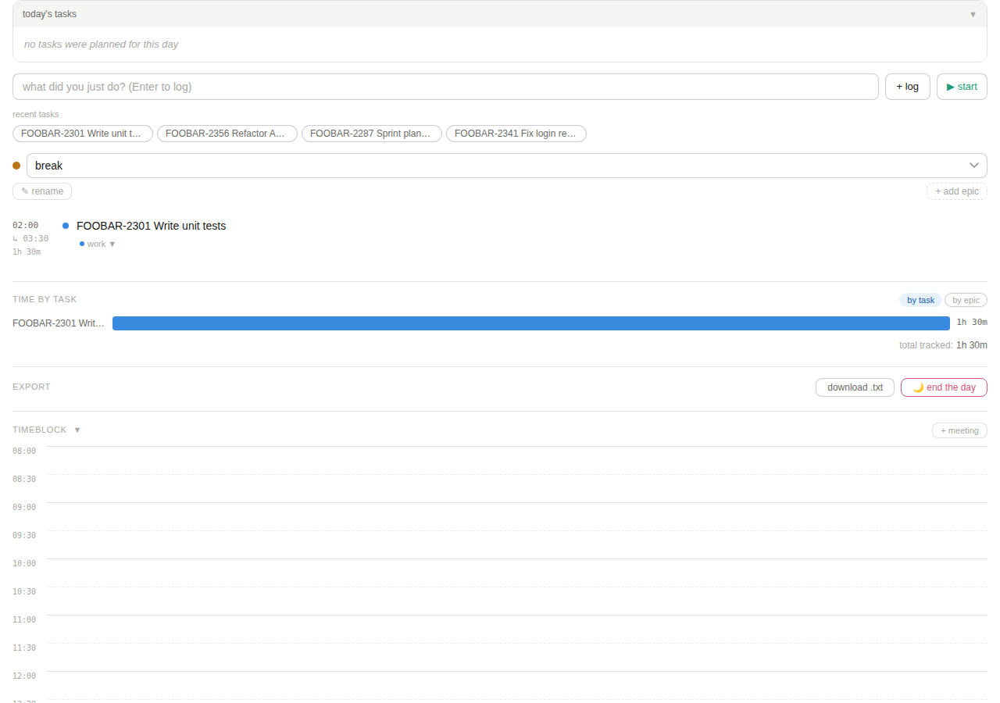
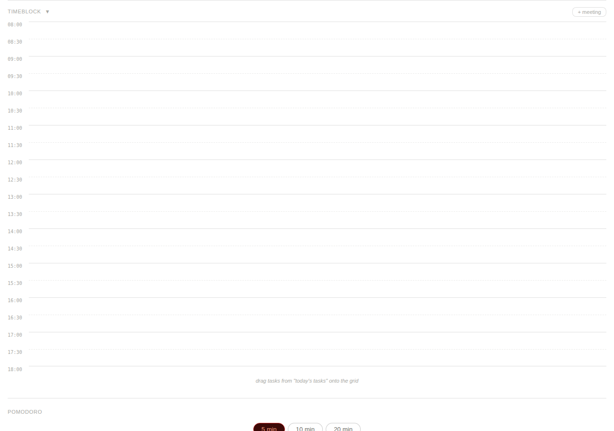
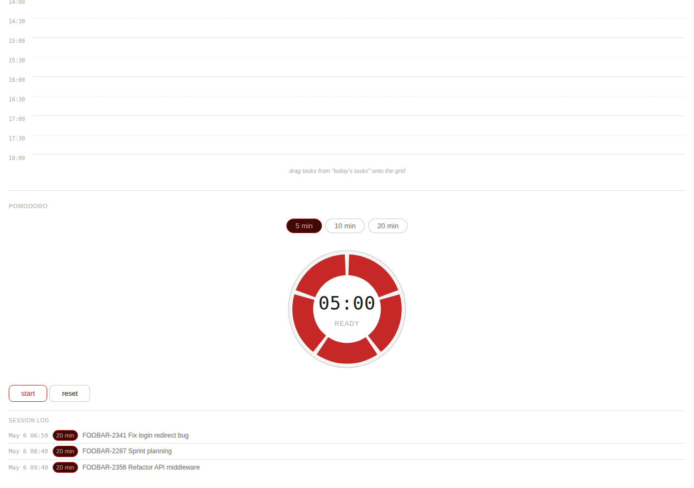

# Work Log

ADHD-friendly work tracker — single HTML file, runs locally in your browser.

## Screenshots









## How to use

> **Important:** The tracker needs to run via a local server (not opened directly as a file) so your data saves correctly between sessions.

### Windows
1. Download `work-log.html` and `launch.bat` into the same folder
2. Double-click `launch.bat`
3. The tracker opens automatically in your browser

### Linux / Mac
1. Download `work-log.html` and `launch.sh` into the same folder
2. Open a terminal in that folder and run:
   ```
   bash launch.sh
   ```
3. The tracker opens automatically in your browser

Your data is stored locally in your browser — nothing is sent anywhere.

## Features

- **Time logging** — log what you're working on with a live timer
- **Today's tasks** — To do / In Progress / Done with epic colour coding
- **Task hierarchy** — drag tasks to create parent-child relationships
- **Timeblock** — visual 08:00–18:00 grid with auto-blocks from logged entries
- **Pomodoro timer** — 5 / 10 / 20 min with session log
- **Epics** — colour-coded categories for your work
- **Weather** — current conditions, rain forecast, sunrise/sunset
- **Moon phase** — current phase, illumination and zodiac sign
- **Finnish nameday** — fetched live from nimipaivat.fi
- **Export** — download your day as a .txt file
- **End the day** — one-click export with test area review
- **Auto-carry** — unfinished tasks roll over to the next day
- **Completed tasks** — 14-day rolling history

## Testing

A smoke test suite is included. Requires Node.js.

```
node smoke-tests.js
```

Or double-click `run-tests.bat` on Windows. To schedule tests to run automatically each morning, run `schedule-tests.bat` once as Administrator.
